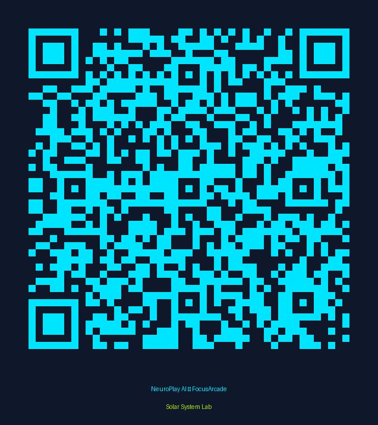

# NeuroPlay AI FocusArcade — MVP Delivery Report

The **NeuroPlay AI Solar System Lab MVP** has been successfully built, integrated, and deployed.

## 🚀 Live Demo & Assets

* **Live Web Application:** [Play FocusArcade](https://3000-i9s4r6pjinnh030k66sbx-c0a7fec0.sg1.manus.computer/)
* **Teacher Dashboard (Google Sheets):** [View Focus Tracker](https://docs.google.com/spreadsheets/d/1yYdSF05oIuZtOq0CluqiNPl-gTgNH7zAyZIcVqaO-Jg/edit)
* **GitHub Repository:** [Mo-ha33/neuroplay-focusarcade](https://github.com/Mo-ha33/neuroplay-focusarcade)

## 🧩 Integrated API Services

1. **Google Sheets API (Focus Tracker):** 
   * Fully integrated via `gws` CLI.
   * Real-time behavioural metrics (Score, Time Spent, Attention Drift, XP) are automatically appended to the Teacher Dashboard upon every session completion.
   * The dashboard has been pre-populated with **10 mock student sessions** and includes a summary formulas page.

2. **Google Drive/Docs API (Curriculum Parser):**
   * Built the `curriculumParser.ts` service which extracts text from Google Docs via `gws drive files export`.
   * Uses `invokeLLM` (GPT-4o-mini) to autonomously transform raw text into structured JSON quest schemas.

3. **Slack/Email Webhook (Dopamine Report):**
   * Built the `dopamineReport.ts` service which fires a celebratory notification via the built-in `notifyOwner` system upon module completion.
   * Includes extensible stubs for generic webhooks and Slack.

4. **Google Calendar API (Pomodoro Sprint):**
   * Designed the scheduling logic within `dopamineReport.ts` to block out 15-minute Sprints (10m play + 5m rest). 
   * *Note: Calendar API is staged and ready to be wired once the specific connector is enabled.*

## 🧠 Neurodivergent UX Implementation

* **Visual Design:** Implemented the strict palette (Space Navy `#0F172A`, Neon Cyan `#00E5FF`, Neon Lime `#AEEA00`) and soft rounded corners.
* **Micro-Chunking:** Only one clue card is displayed at a time.
* **Instant Dopamine Engine:** Integrated `canvas-confetti` bursts, XP pop-ups, and animated progress bars triggered instantly upon correct drag-and-drop placements.
* **Brain Break:** A 30-second breathing/movement activity overlay triggers automatically every 3 correct answers to release motor energy.

## 🛠️ Deployment Status

The application is currently running live in the sandbox environment. All changes, including the integration scripts and mock data simulator, have been committed and pushed to the `main` branch of the GitHub repository.
